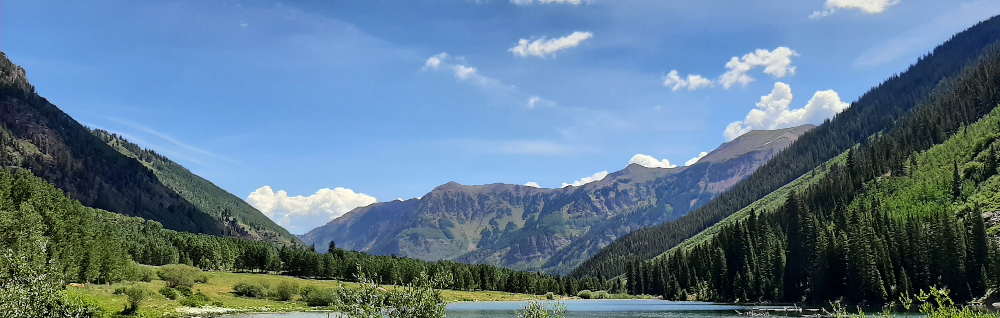

## Welcome

I am an environmental and sustainability researcher specializing in interdisciplinary systems modeling to address complex issues within coupled human and natural systems. My research centers on assessing ecosystem service flows and their interactions with nature-based solutions, biodiversity, human demands, and global environmental changes. My overall research objectives aim to promote the equitable distribution of ecosystem services for disadvantaged communities. Operating at regional and global levels, I use advanced spatial and statistical methods (e.g., remote sensing, GIS, network modeling, and machine learning), integrating interdisciplinary and cross-sectoral open data. Data harmonization and analyses are performed on high-performance computing clusters using open-source software.

## Area of interest

Environmental data science; coupled human and natural systems (CHANS); ecosystem services; sustainability; nature-based solutions; climate mitigation and adaptation
