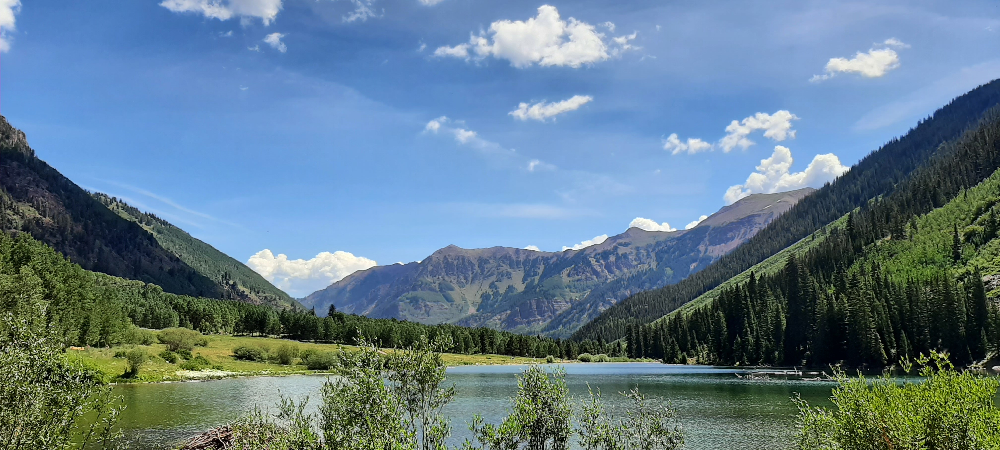

<!-- Google tag (gtag.js) -->

## Welcome

I work in environmental and sustainability science, specializing in interdisciplinary systems modeling to address complex global environmental challenges. My research integrates the telecoupling framework with enviornmental data science to investigate the distant impacts of climate-related extremes on essential ecosystem services and how these impacts on human well-being can be mitigated by nature-based solutions. My overall research objectives aim to promote equitable and sustainable management strategies that enhance community resilience. Operating at both regional and global levels, I integrate advanced spatial and statistical methods (e.g., remote sensing, GIS, network modeling, econometrics, and machine learning) into coupled systems modeling using big, interdisciplinary open data. Data harmonization and analyses are performed on high-performance computing clusters with open-source software.

## Area of interest

Open data science; coupled human and natural systems (CHANS); ecosystem services; sustainability; nature-based solutions; climate mitigation and adaptation
