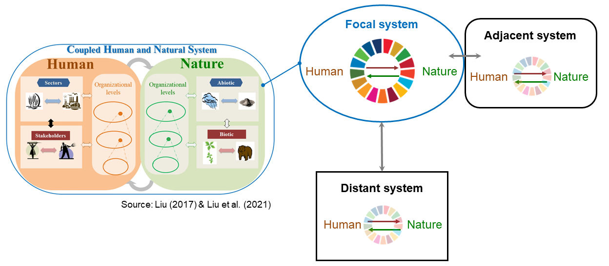
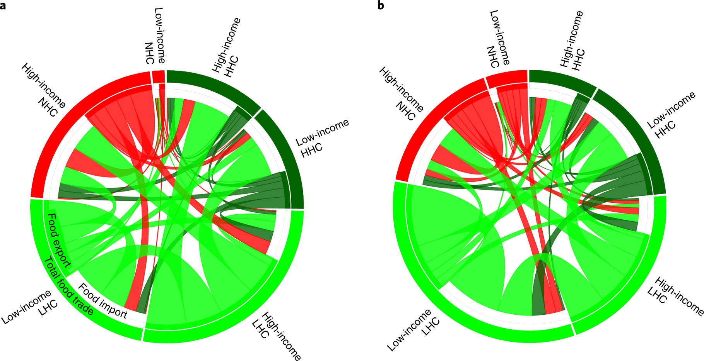
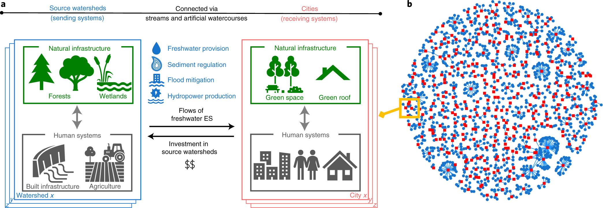
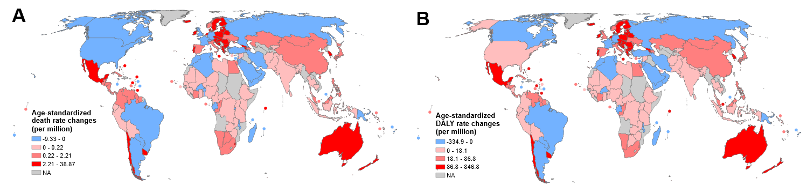

The world is increasingly interconnected environmentally and socioeconomically through various flows such as the movement of goods, services, people, and capital. These flows have enormous impacts on biodiversity, ecosystem services, and sustainable development worldwide. However, little research has been systematically conducted on such flows across multiple coupled human and natural systems simultaneously. In response, I use the frameworks of coupled human and natural systems and telecoupling (human-nature interactions between distant systems). My long-term research goal is to help mitigate the negative impacts of ecosystem service flows on both people and the environment through the implementation of pro-active landscape planning and cross-border policies.

{: .align-center width="800px"}

## Ecosystem service flows

With rapid economic and population growth, the increasing separation between where ecosystem services are needed and from where they are supplied complicates the management of multiple ecosystem services. Increasing demands for ecosystem services across regions can accelerate ecosystem service flows yet also damage the capacity to provide these services in supply areas. This project investigates ecosystem service flows such as freshwater, food, nature-based tourism, and air pollution as well as their interactions with biodiversity, human well-being, and nature-based solutions.

 
  
 <a href="https://www.nature.com/articles/s43016-022-00499-7">[Chung and Liu, Nature Food, 2022]</a>

## Nature-based solutions

Nature-based solutions (NbS) become crucial for natural and working lands to sustain environmental and socioeconomic benefits under increasing anthropogenic pressures. Nature-based solutions exist everywhere in various forms such as protected areas and urban green space, yet little research has examined how existing nature-based solutions provide multiple benefits of ecosystem services beyond their initial objectives. This project examines the diverse roles of nature-based solutions in sustaining essential ecosystem services and how these changes affect human systems from global to local levels.

 
  
 <a href="https://www.nature.com/articles/s41893-021-00786-4">[Chung et al, Nature Sustainability, 2021]</a>

## Impacts on humans

{: .align-center width="800px"}[Chung et al, BMJ Global Health, 2021](https://gh.bmj.com/content/6/11/e006394.abstract)
