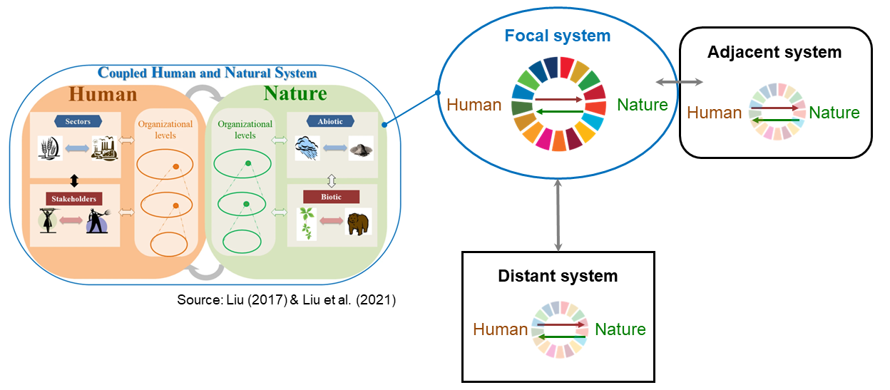
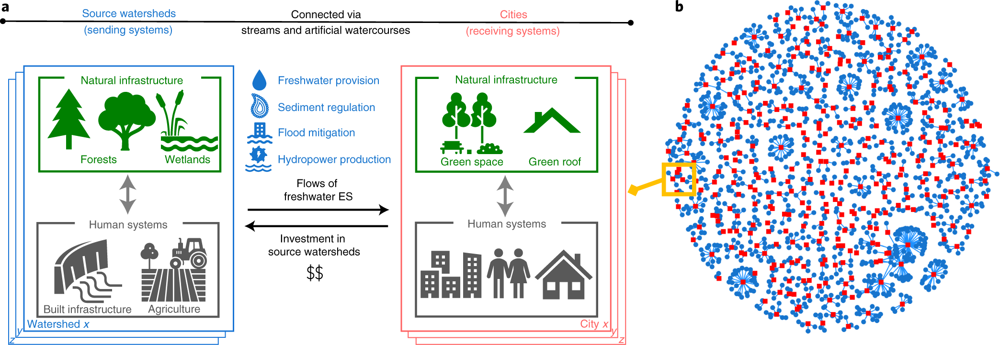
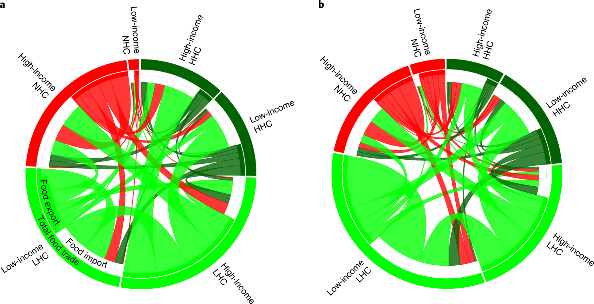
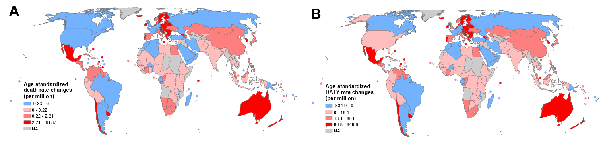

The world is increasingly interconnected environmentally and socioeconomically through flows of goods, services, people, and capital. These flows produce enormous impacts on biodiversity, ecosystem services, and sustainable development worldwide, yet management actions in one location often generate unintended cross-boundary spillovers. In response, I use the telecoupling framework (human-nature interactions between distant systems) to investigate how ecosystem service flows interact with conservation policies and human demands across local, regional, and global scales. My long-term research goal is to provide science-based evidence that advances environmental and socioeconomic sustainability through equitable landscape planning and cross-border conservation policy.

{: .align-center width="800px"}

## Implementation Gaps in Nature-Based Solutions

Nature-based solutions become crucial for natural and working lands to sustain environmental and socioeconomic benefits under increasing anthropogenic pressures. However, promising nature-based solutions often fail to deliver expected societal benefits under climate extremes. I examine why forest restoration for water security is decoupled from actual water diversions by infrastructure operations and legal frameworks, why passive protection alone does not guarantee carbon durability in fire-prone forests, and how strategic management can reduce long-term carbon losses. This research reveals that real-world efficacy of nature-based solutions depends on alignment with governance systems that control resource access under scarcity.

{: .align-center width="700px"}

*Chung et al, Nature Sustainability, 2021* ([link](https://www.nature.com/articles/s41893-021-00786-4)).

## Multi-Hazard Risks and Environmental Justice

With rapid climate change, the increasing co-occurrence of wildfires, heatwaves, and droughts creates compounding risks to public health and infrastructure systems. Little research has systematically examined how multiple natural hazards interact to affect disadvantaged communities. I developed a multi-hazard framework to quantify PM₂.₅ exposure across the United States, finding that western rural communities face the highest sensor deserts and experience the most severe air quality degradation when climate extremes co-occur. This research informs equitable health alert systems and monitoring strategies that prioritize high-exposure, low-coverage communities.

## Telecoupled Ecosystem Service Flows

With increasing separation between where ecosystem services are needed and where they are supplied, understanding cross-boundary flows becomes essential for sustainable management. I investigate how international food trade affects biodiversity in both exporting and importing countries, how protected forests in source watersheds interact with urban green spaces to sustain freshwater for downstream cities, and how conservation strictness affects both tourism demand and species richness in protected areas. By quantifying these telecoupled linkages (trade networks, hydrological flows, visitor movements), my research challenges prevailing narratives and reveals pathways toward win-win outcomes for both people and nature.

{: .align-center width="600px"}

*Chung and Liu, Nature Food, 2022* ([link](https://www.nature.com/articles/s43016-022-00499-7)).

## Future Directions

I will pursue three interconnected research directions: (1) ecological regime shifts and socioeconomic thresholds in working landscapes, where I will quantify critical drivers of forest-to-shrubland conversions and assess how vegetation shifts fragment wildlife habitat while threatening community viability; (2) multi-hazard resilience of coupled water-energy-health systems, where I will map cascading failure mechanisms and test interventions from energy diversification to strategic forest management; (3) telecoupled climate burdens in global supply chains, where I will develop virtual hazard metrics to identify which commodities transfer wildfire smoke, heat stress, or drought risk from consuming to producing regions. This integrated research program advances conservation science at the nexus of cross-boundary spillovers, infrastructure resilience, and environmental justice.

{: .align-center width="900px"}

*Chung et al, BMJ Global Health, 2021* ([link](https://gh.bmj.com/content/6/11/e006394.abstract)).
